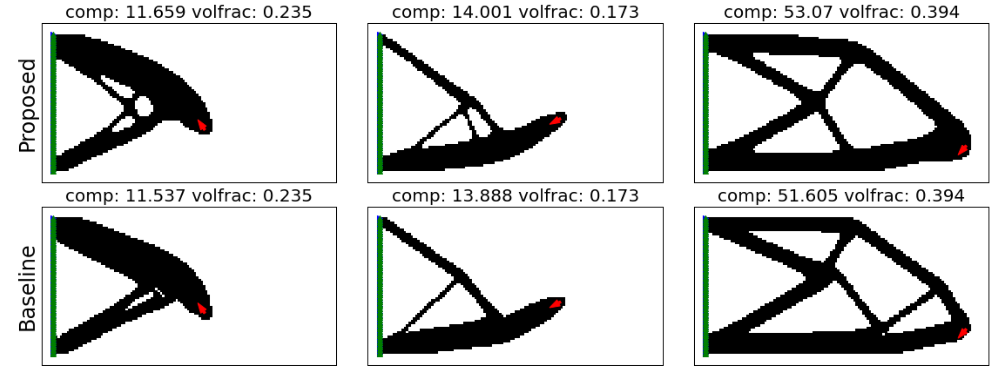

# deep-topopt
Deep learning-based topology optimization with a minimum compliance loss function.

Finite element meshing and analysis is handled in the `FEA` module, while the loss function and analytical gradients are handled in the `spalg` module.

To run the model type `python main.py 'SAVE_PATH' 'MODEL_NAME' 'DATA_PATH'`. The following additional arguments can also be parsed:

```python
parser.add_argument('--pretrained',default="") # save path for pretrained weights
parser.add_argument('--batch_size', default=16, type=int) 
parser.add_argument('--epochs', default=100, type=int)
parser.add_argument('--lr', default=2e-4, type=float) # learning rate
parser.add_argument('--clip', default=1, type=float) # gradient clipping value
parser.add_argument('--dens_penal', default=2, type=float) # SIMP penalization
parser.add_argument('--vol_penal', default=1e1, type=float) # volume penalization
```

Send a mail to maoel@mek.dtu.dk if you want to obtain the datasets needed to train the model.


